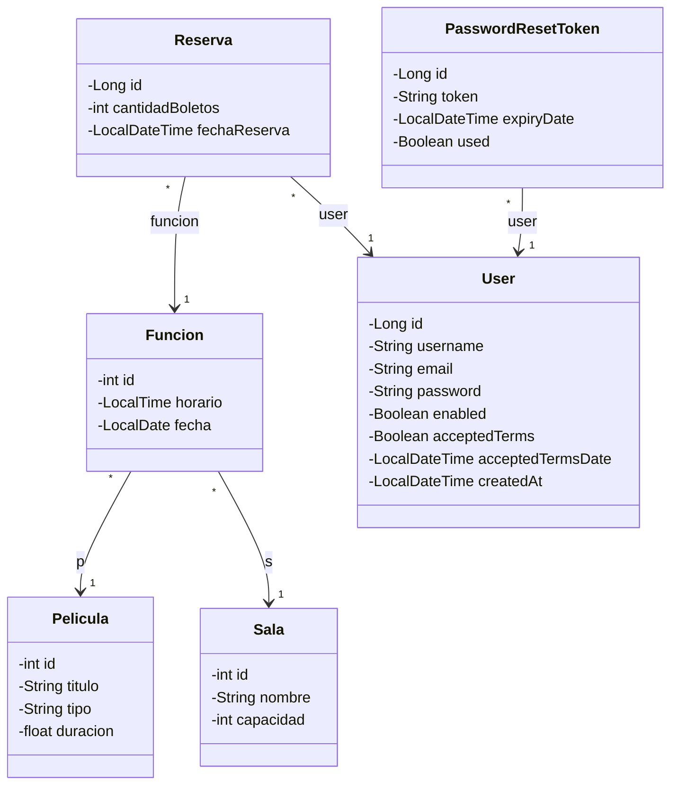

# Diagrama de Clases - Gestión de Películas

## Relaciones

- **Funcion - Pelicula**: Una función pertenece a una película (ManyToOne)
- **Funcion - Sala**: Una función se realiza en una sala (ManyToOne)
- **Reserva - User**: Una reserva pertenece a un usuario (ManyToOne)
- **Reserva - Funcion**: Una reserva es para una función específica (ManyToOne)
- **PasswordResetToken - User**: Un token de reseteo pertenece a un usuario (ManyToOne)
